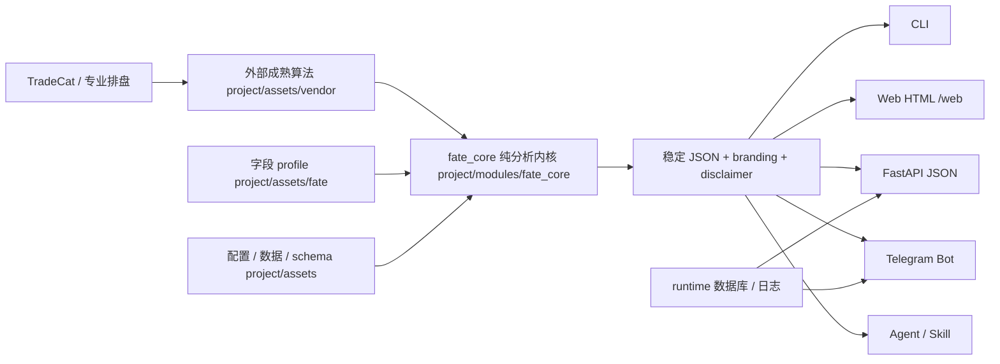

# FateCat

<p align="center">
  
</p>

<div align="center">

**把专业命理排盘结果变成 AI 可稳定消费的结构化输入**

**外部成熟算法 × 纯命理分析内核 × CLI / Web / Telegram / FastAPI / Agent 统一交付层**

<p>
  <a href="https://github.com/tukuaiai/fatecat"></a>
  <a href="https://github.com/tukuaiai/fatecat"></a>
  <a href="https://github.com/tukuaiai/fatecat"></a>
  
  
  
  
  
</p>

<p>
  <a href="#overview">项目总览</a> ·
  <a href="#skill-repo">Skill 仓库</a> ·
  <a href="#modes">模式选择</a> ·
  <a href="#architecture">架构</a> ·
  <a href="#quick-start">快速开始</a> ·
  <a href="#web">Web HTML</a> ·
  <a href="#commands">常用命令</a> ·
  <a href="#layout">目录结构</a> ·
  <a href="#hygiene">仓库卫生</a> ·
  <a href="#docs">文档地图</a> ·
  <a href="#disclaimer">免责声明</a>
</p>

</div>

> [!WARNING]
> 本项目及 AI 分析结果仅供传统文化研究、算法测试与娱乐参考。命理学非精密科学，命运掌握在自己手中。使用者因轻信或误读本程序结果而产生的任何心理、财务及生活决策后果，本开源项目及开发者概不负责。

> [!TIP]
> `交易猫 TradeCat` 赞助与支持本项目。推荐工作流：先用交易猫完成专业排盘，再把结构化命盘交给 AI 深度分析，尽量减少模型乱编。
>
> - TradeCat Repo: `https://github.com/tukuaiai/tradecat`
> - FateCat Repo: `https://github.com/tukuaiai/fatecat`
> - CA: `0x8a99b8d53eff6bc331af529af74ad267f3167777`

<a id="overview"></a>

## 项目总览

FateCat 不是让 AI 直接“脑补排盘”，而是把“排盘”和“解释”拆开：

1. 成熟排盘系统或外部算法负责结构化计算。
2. FateCat 负责统一字段、统一输出、统一交付入口。
3. AI / Agent 只基于稳定 JSON 或标准 Markdown 做解释、总结与后续任务。

| 维度 | 说明 |
|------|------|
| 项目角色 | 专业排盘结果到 AI 分析结果之间的结构化中间层 |
| 当前形态 | 标准单-skill 仓库；根目录是 skill 外壳，`project/` 是真实源码 |
| 推荐链路 | `TradeCat / 专业排盘` -> `FateCat pure-analysis` -> `AI / Web / Telegram / API / Agent` |
| 核心真相源 | `project/assets/fate/` 定义字段 profile，`project/assets/vendor/` 保留成熟算法快照 |
| 明确边界 | 不让 AI 直接口算排盘，不在 `project/assets/vendor/` 魔改外部源码 |

<a id="skill-repo"></a>

## Skill 仓库

当前根仓库承担 4 个职责：

- 单-skill 仓库入口：`SKILL.md` 定义 agent 如何接手、安装、检查、执行。
- 生命周期治理层：`assets/lifecycle/`、`references/`、根脚本负责需求到运维的标准化闭环。
- 统一执行包装层：根 `scripts/` 把源码仓库常用动作封成稳定入口。
- 可导出 bundle 源：可把当前 skill 连同运行时骨架导出为独立交付包。

真实业务源码与运行时真相源在：

- `project/modules/fate_core/`：纯命理分析内核。
- `project/modules/telegram/`：Web HTML、Telegram、FastAPI、报告生成与 legacy 适配。
- `project/assets/`：配置、schema、字段 profile、外部成熟算法与数据资产。
- `project/runtime/`：数据库与运行态产物。

<a id="modes"></a>

## 模式选择

| 场景 | 推荐入口 | 输出形态 | 是否要求 `FATE_BOT_TOKEN` | 说明 |
|------|----------|----------|---------------------------|------|
| 本地调试、脚本串联、先排盘再喂 AI | `bash scripts/pure-analysis.sh` | `stdout JSON` / 文件 JSON | 否 | 最稳定、最适合结构化输出 |
| 人类在浏览器中录入并复制报告 | `bash scripts/serve-api.sh` -> `/web` | HTML 表单 + Markdown | 否 | 直接输入出生信息，输出可复制 Markdown |
| 要接服务、工作流、上层系统 | `bash scripts/serve-api.sh` | HTTP JSON | 否 | 适合 Webhook、自动化平台、自建前端 |
| 想直接聊天式使用 | `bash scripts/serve-bot.sh` | Telegram 消息 / 报告文件 | 是 | 人工交互最直接 |
| OpenClaw / Harness / 自动化 Agent | `project` 内自举入口 | 非交互 CLI / 健康检查 | 纯分析否，Bot 是 | 适合批处理与自动部署 |

<a id="architecture"></a>

## 架构



推荐工作流：

```text
TradeCat / 专业排盘
        ↓
FateCat pure-analysis 输出稳定 JSON
        ↓
AI 基于结构化字段做命理解读
        ↓
Web / Telegram / API / Agent 继续交付
```

<a id="quick-start"></a>

## 快速开始

### 1. 首次准备运行时

```bash
bash scripts/bootstrap.sh --with-dev
```

只需要最小运行时：

```bash
bash scripts/bootstrap.sh
```

### 2. 先做标准预检

```bash
bash scripts/preflight.sh --mode pure --bootstrap --pretty
```

交付层检查：

```bash
bash scripts/preflight.sh --mode delivery --bootstrap --pretty
```

### 3. 执行一次命理排盘并输出文件

```bash
mkdir -p output
bash scripts/pure-analysis.sh \
  --input-json '{"birthDateTime":"1990-01-01 08:00:00","gender":"男","longitude":116.4074,"latitude":39.9042,"birthPlace":"北京市","name":"测试样本"}' \
  --output-file output/bazi-result.json \
  --pretty
```

### 4. 做完整验收

```bash
bash scripts/acceptance.sh --with-dev
```

完整验收覆盖 shell 语法、strict skill 校验、纯分析 smoke、vendor health、全量 pytest、ruff、format、`fate_core` mypy、API/Bot dry-run、导出包卫生检查与导出包 smoke。

<a id="web"></a>

## Web HTML

Web 版遵循零美化语义界面：原生 HTML 表单、服务端直出、psql ASCII 字段表、Markdown 原文 `<pre><code>` 展示、复制按钮只做渐进增强。

启动 API：

```bash
bash scripts/preflight.sh --mode delivery --bootstrap --pretty
bash scripts/delivery-smoke.sh --target api
bash scripts/serve-api.sh
```

访问：

```text
http://127.0.0.1:8001/web
```

字段契约：

| 字段 | 必填 | 说明 |
|------|------|------|
| 出生日期 | 是 | `YYYY-MM-DD` |
| 出生时间 | 是 | `HH:MM` 或 `HH:MM:SS` |
| 出生地区 | 是 | 中文地点或 `lng,lat`，如 `北京` / `116.4074,39.9042` |
| 性别 | 是 | `male` / `female`；现有排盘逻辑必需，不能默认猜测 |
| 姓名 | 否 | 为空时报告标题使用“命主” |

<a id="commands"></a>

## 常用命令

```bash
bash scripts/bootstrap.sh --with-dev
bash scripts/preflight.sh --mode pure --bootstrap --pretty
bash scripts/preflight.sh --mode pure --bootstrap --smoke --output-file output/preflight-sample.json --pretty
bash scripts/preflight.sh --mode delivery --bootstrap --pretty
bash scripts/pure-analysis.sh --input-file input.json --output-file output/result.json --pretty
bash scripts/acceptance.sh --with-dev
bash scripts/delivery-smoke.sh --target api
bash scripts/serve-api.sh
bash scripts/delivery-smoke.sh --target bot --startup-timeout 8
bash scripts/clean-runtime.sh --dry-run
bash scripts/export-runtime.sh --output-parent /tmp/fatecat-export --mode lite
bash scripts/check-export-hygiene.sh /tmp/fatecat-export/fatecat
```

<a id="layout"></a>

## 目录结构

```text
fatecat/
├── AGENTS.md
├── README.md
├── SKILL.md
├── assets/
│   └── lifecycle/
├── references/
│   ├── commands.md
│   ├── execution-playbook.md
│   └── troubleshooting.md
├── scripts/
│   ├── acceptance.sh
│   ├── check-export-hygiene.sh
│   ├── clean-runtime.sh
│   ├── delivery-smoke.sh
│   ├── export-runtime.sh
│   └── preflight.sh
└── project/
    ├── AGENTS.md
    ├── README.md
    ├── assets/
    ├── modules/
    │   ├── fate_core/
    │   └── telegram/
    ├── runtime/
    └── tests/
```

根目录与 `project/` 的边界：

- 根目录：skill 入口、预检、验收、导出、生命周期包装。
- `project/`：真实业务源码、运行时骨架、项目级文档真相源。
- `project/assets/vendor/`：外部成熟仓库快照，默认只读。
- `project/runtime/`：运行态数据，不回灌静态资产目录。

<a id="hygiene"></a>

## 仓库卫生

默认卫生规则：

- 不提交 `project/assets/config/.env`。
- 不提交 `.venv`、`.pytest_cache`、`.ruff_cache`、`.mypy_cache`。
- 不分发 `node_modules/`。
- 不分发 `__pycache__`、`*.pyc`、`*.pyo`。
- 不把 `project/modules/telegram/output/`、运行态 `.db` / `.sqlite` 或本地 `.env` 放进导出包。
- 导出后必须运行 `scripts/check-export-hygiene.sh`。

清理本地运行态：

```bash
bash scripts/clean-runtime.sh
```

导出并检查：

```bash
rm -rf /tmp/fatecat-export
bash scripts/export-runtime.sh --output-parent /tmp/fatecat-export --mode lite
bash scripts/check-export-hygiene.sh /tmp/fatecat-export/fatecat
```

<a id="docs"></a>

## 文档地图

- [SKILL.md](SKILL.md)：agent 如何接手、预检、执行、验收。
- [references/index.md](references/index.md)：参考文档导航。
- [references/execution-playbook.md](references/execution-playbook.md)：标准执行链路。
- [references/commands.md](references/commands.md)：命令速查。
- [references/ops-pack.md](references/ops-pack.md)：运维与加固。
- [project/README.md](project/README.md)：项目级产品说明与业务背景。
- [project/assets/docs/功能状态.md](project/assets/docs/功能状态.md)：标准报告与未来功能边界。

<a id="disclaimer"></a>

## 免责声明

本项目及 AI 分析结果仅供传统文化研究、算法测试与娱乐参考。命理学非精密科学，命运掌握在自己手中。使用者因轻信或误读本程序结果而产生的任何心理、财务及生活决策后果，本开源项目及开发者概不负责。
