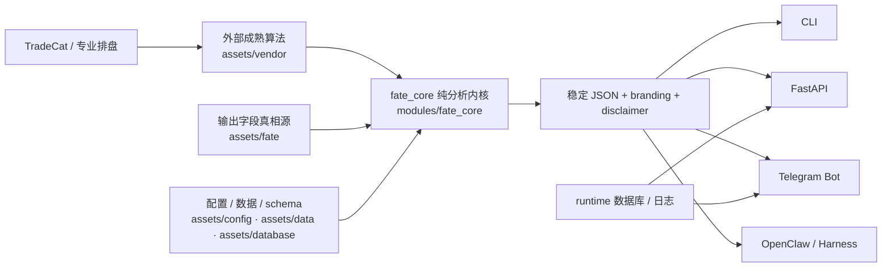

<p align="center">
  
</p>

<div align="center">

# FateCat

**把专业命理排盘结果变成 AI 可稳定消费的结构化输入**

**外部成熟算法 × 纯命理分析内核 × CLI / Telegram / FastAPI / Agent 统一交付层**

<p>
  <a href="https://github.com/tukuaiai/fatecat"></a>
  <a href="https://github.com/tukuaiai/fatecat"></a>
  <a href="https://github.com/tukuaiai/fatecat"></a>
  
  
  
  
  
  
</p>

<p>
  <a href="#overview">项目总览</a> ·
  <a href="#why-fatecat">为什么需要</a> ·
  <a href="#highlights">核心亮点</a> ·
  <a href="#modes">模式选择</a> ·
  <a href="#architecture">架构与工作流</a> ·
  <a href="#quick-start">快速开始</a> ·
  <a href="#contract">输入输出契约</a> ·
  <a href="#ai-template">AI / Agent 模板</a> ·
  <a href="#cli">CLI 调用</a> ·
  <a href="#delivery">Telegram / API</a> ·
  <a href="#agent">Agent 一键部署</a> ·
  <a href="#layout">目录结构</a> ·
  <a href="#roadmap">路线图</a> ·
  <a href="#docs-map">文档地图</a> ·
  <a href="#faq">FAQ</a> ·
  <a href="#contributing">参与协作</a> ·
  <a href="#disclaimer">免责声明</a>
</p>

<p>
  <a href="./assets/docs/operations/Agent%20%E4%B8%80%E9%94%AE%E9%83%A8%E7%BD%B2.md"></a>
  <a href="./assets/docs/operations/Telegram%20Bot%20%E5%90%AF%E5%8A%A8%E4%B8%8E%E9%87%8D%E5%90%AF%E6%8C%87%E5%8D%97.md"></a>
  <a href="./assets/docs/architecture/%E5%BD%93%E5%89%8D%E7%9B%AE%E5%BD%95%E7%BB%93%E6%9E%84.md"></a>
  <a href="https://github.com/tukuaiai/tradecat"></a>
</p>

</div>

> [!WARNING]
> 本项目及AI分析结果仅供传统文化研究、算法测试与娱乐参考。命理学非精密科学，命运掌握在自己手中。使用者因轻信或误读本程序结果而产生的任何心理、财务及生活决策后果，本开源项目及开发者概不负责。

> [!TIP]
> `交易猫 TradeCat` 赞助与支持本项目。推荐工作流：先用交易猫完成专业排盘，再把结构化命盘交给 AI 深度分析，尽量减少模型乱编。
>
> - TradeCat Repo：`https://github.com/tukuaiai/tradecat`
> - FateCat Repo：`https://github.com/tukuaiai/fatecat`
> - CA：`0x8a99b8d53eff6bc331af529af74ad267f3167777`

<a id="overview"></a>

## 项目总览

| 维度 | 说明 |
|------|------|
| 项目角色 | FateCat 是“专业排盘结果 → AI 分析结果”之间的结构化中间层 |
| 最适合谁 | 需要把命盘稳定交给 CLI、Telegram、FastAPI、OpenClaw、Harness 或其他 Agent 的开发者 |
| 推荐链路 | `TradeCat / 专业排盘` → `FateCat pure-analysis` → `AI / Telegram / API / Agent` |
| 核心真相源 | `assets/fate/` 定义输出字段，`assets/vendor/` 提供成熟算法，`assets/config/` 统一配置 |
| 明确边界 | 不重写所有底层历法、不让 AI 直接口算排盘、不在 `assets/vendor/` 上魔改源码 |

<a id="why-fatecat"></a>

## 为什么需要 FateCat

FateCat 的定位不是重写所有底层历法与命理算法，而是把已经成熟的排盘仓库、统一字段配置、纯分析内核和交付层稳定地胶合在一起，让同一份命盘结果可以被 CLI、Telegram、FastAPI 与 Agent 可靠复用。

它主要解决三类老问题：

| 问题 | 典型后果 | FateCat 的处理方式 |
|------|----------|--------------------|
| 直接让 AI 自己排盘 | 胡编乱造、字段漂移、上下文不稳 | 先交给成熟排盘系统，再把结果收敛成稳定 JSON |
| 外部命理仓库分散 | 调用方式不同、依赖不同、输出不同 | 用 `assets/vendor/` + `fate_core` 做统一胶水层 |
| 交付场景很多 | CLI、Bot、API、Agent 各写一套 | 用统一配置、统一入口、统一 branding/disclaimer |

一句话总结：

> **TradeCat / 外部成熟仓库负责更专业的排盘，FateCat 负责把排盘结果变成 AI 友好的稳定输入，再交给 Telegram / API / Agent 使用。**

<a id="highlights"></a>

## 核心亮点

- **纯命理分析内核**：`modules/fate_core/` 负责纯分析能力，输出字段由 `assets/fate/` 真相源约束，避免不同入口结果漂移。
- **统一命令行入口**：安装后统一使用 `.venv/bin/fatecat`，支持 `pure-analysis`、`health`、`serve`，适合脚本和批处理。
- **交付层独立**：`modules/telegram/` 负责 Telegram Bot、FastAPI 与报告生成，不污染纯分析内核。
- **Agent 友好**：内置 `general`、`openclaw`、`harness` 三种非交互自举 profile，适合 OpenClaw / Harness / 自动化系统。
- **输出带来源与免责声明**：CLI、API、Telegram 报告统一携带 `branding` / `disclaimer`，保证来源信息和风险提醒不丢失。
- **静态资产统一收敛**：配置、文档、schema、古籍语料、外部成熟仓库都统一放进 `assets/`，运行态只留在 `runtime/`。

## 可信性与边界

- **排盘交给成熟算法**：底层历法、节气、真太阳时、传统字段优先复用 `assets/vendor/` 中的成熟仓库，不在 FateCat 内重新发明。
- **解释交给 `fate_core`**：纯命理分析逻辑集中在 `modules/fate_core/`，避免 Telegram / FastAPI / Bot UI 逻辑反向污染分析层。
- **字段由 profile 驱动**：`assets/fate/profiles/pure_analysis.json` 是当前稳定输出契约真相源，AI / Agent 应优先依赖它。
- **来源与风险提示强制保留**：CLI、API、Telegram、错误输出统一附带 `branding` 与 `disclaimer`，方便下游继续保留来源与免责声明。

<a id="modes"></a>

## 模式选择

| 场景 | 推荐入口 | 输出形态 | 是否要求 `FATE_BOT_TOKEN` | 说明 |
|------|----------|----------|---------------------------|------|
| 本地调试、脚本串联、先排盘再喂 AI | `fatecat pure-analysis` | `stdout JSON` / 文件 JSON | 否 | 最稳定、最适合结构化输出 |
| 想直接聊天式使用 | `fatecat serve bot` | Telegram 消息 / 报告 | 是 | 人工交互最直接 |
| 要接服务、工作流、上层系统 | `fatecat serve api` | HTTP JSON | 否 | 适合 Webhook、自动化平台、自建前端 |
| OpenClaw / Harness / 自动化 Agent | `make bootstrap-openclaw` / `make bootstrap-harness` | 非交互 CLI / 健康检查 | 纯分析否，Bot 是 | 最适合批处理与自动部署 |

如果你的目标只是“避免 AI 乱编”，默认推荐：

1. 先用 `TradeCat` 或其他专业来源完成排盘
2. 再用 `FateCat CLI` 输出稳定结构化结果
3. 最后把 JSON 交给 AI 做解释、总结和扩展

<a id="architecture"></a>

## 架构与推荐工作流



推荐工作流：

```text
TradeCat / 专业排盘
        ↓
FateCat pure-analysis 输出稳定 JSON
        ↓
AI 基于结构化字段做命理解读
        ↓
Telegram / API / Agent 继续交付
```

为什么不推荐让 AI 直接“口算排盘”：

- 排盘本质上是结构化计算问题，优先交给成熟算法和专业排盘系统。
- 解读本质上是生成式问题，适合交给 AI 在稳定字段之上做总结和延展。
- 把“计算”和“解释”拆开，能明显减少字段漂移、术语错位和模型脑补。
- 同一份 JSON 可复用给 CLI、API、Telegram 和 Agent，不需要每条链路重写。

<a id="quick-start"></a>

## 快速开始

### 0. 最短路径

- 只做纯命理排盘 + AI 分析：`make bootstrap-agent` → `.venv/bin/fatecat health --mode pure --json` → `.venv/bin/fatecat pure-analysis ...`
- 需要 Telegram / API：先复制 `assets/config/.env`，填写 `FATE_BOT_TOKEN` 与 `FATE_BOT_PROXY_URL`，再执行 `.venv/bin/fatecat serve both`
- 需要 Agent 集成：直接跳到 [Agent 一键部署](#agent)，优先用 `make bootstrap-openclaw` 或 `make bootstrap-harness`
- 快速跳转：[输入输出契约](#contract) · [CLI 调用](#cli) · [Telegram / API](#delivery) · [目录结构](#layout)

### 第一次跑通纯分析

如果你只想先验证“结构化排盘 → JSON 输出 → 再喂给 AI”这条主链路，直接执行：

```bash
cat > request.json <<'EOF'
{"birthDateTime":"1990-01-01 08:00:00","gender":"男","longitude":116.4074,"latitude":39.9042,"birthPlace":"北京市"}
EOF

make bootstrap-agent
.venv/bin/fatecat pure-analysis --input-file request.json --output-file output/pure_analysis.json --pretty
cat output/pure_analysis.json
```

看到带 `success`、`data`、`disclaimer`、`branding` 的 JSON，就说明主路径已经跑通。

### 1. 环境要求

- Python `3.12+`
- Node.js `18+`

### 2. 安装

<details>
<summary><b>方式一｜Agent / 非交互一键自举（推荐）</b></summary>

通用模式：

```bash
make bootstrap-agent
```

OpenClaw / Harness：

```bash
make bootstrap-openclaw
make bootstrap-harness
```

底层会调用 `assets/deploy/bootstrap_agent.sh`，自动完成：

- 创建虚拟环境
- 安装 FateCat
- 可选写入本地 `.env` 模板
- 执行纯分析健康检查

</details>

<details>
<summary><b>方式二｜本地源码安装</b></summary>

```bash
python3 -m venv .venv
.venv/bin/pip install -e .
```

或：

```bash
make install
```

安装完成后统一入口为：

```bash
.venv/bin/fatecat
```

如果你已经执行：

```bash
source .venv/bin/activate
```

后续也可以直接使用：

```bash
fatecat
```

</details>

### 3. 初始化配置

```bash
cp assets/config/.env.example assets/config/.env
vim assets/config/.env
```

如果只跑纯命理 CLI，不强制要求 `FATE_BOT_TOKEN`。
如果需要启动 Telegram Bot / 交付层，最少填写：

```env
FATE_BOT_TOKEN=your_bot_token_here
FATE_ADMIN_USER_IDS=123456789
FATE_BOT_PROXY_URL=http://127.0.0.1:7890
FATE_SERVICE_HOST=0.0.0.0
FATE_SERVICE_PORT=8001
FATE_CORS_ALLOW_ORIGINS=https://your-domain.example
FATE_API_TOKEN=change-me
FATE_API_ADMIN_TOKEN=change-me-admin
FATE_API_USER_TOKENS=u1:change-me-user-token
```

<details>
<summary><b>代理与 Telegram 配置</b></summary>

Telegram 出站代理统一使用：

```env
FATE_BOT_PROXY_URL=http://127.0.0.1:7890
```

支持：

- `http://`
- `https://`
- `socks5://`

常见本地代理写法：

- Clash / Mihomo HTTP：`http://127.0.0.1:7890`
- Clash / Mihomo SOCKS：`socks5://127.0.0.1:7891`

</details>

### 4. 启动

后台方式：

```bash
make start
make status
```

前台方式：

```bash
.venv/bin/fatecat serve api
.venv/bin/fatecat serve bot
.venv/bin/fatecat serve both
```

### 5. 第一个健康检查

```bash
.venv/bin/fatecat health --mode pure --json
.venv/bin/fatecat health --mode delivery --json
```

### 6. 第一个 AI 投喂

跑通 `pure-analysis` 后，下一步不要让 AI 自己“脑补排盘”，而是：

1. 保留 `output/pure_analysis.json`
2. 直接复用 [AI / Agent 分析模板](#ai-template)
3. 让 AI 严格基于结构化字段做解释、总结和建议

<a id="contract"></a>

## 输入输出契约

### `pure-analysis` 输入支持两种形态

#### 1. 扁平输入

```json
{
  "birthDateTime": "1990-01-01 08:00:00",
  "gender": "男",
  "longitude": 116.4074,
  "latitude": 39.9042,
  "birthPlace": "北京市",
  "useTrueSolarTime": true
}
```

#### 2. API 请求结构

```json
{
  "name": "张三",
  "gender": "male",
  "birthDate": "1990-05-15",
  "birthTime": "14:30:00",
  "birthPlace": {
    "name": "深圳",
    "longitude": 114.1,
    "latitude": 22.5,
    "timezone": "Asia/Shanghai"
  },
  "options": {
    "useTrueSolarTime": true,
    "calendarType": "solar"
  }
}
```

### `pure-analysis` 输出顶层结构

```json
{
  "success": true,
  "profile": "pure_analysis",
  "data": { "...": "命理分析字段集合" },
  "disclaimer": "本项目及AI分析结果仅供传统文化研究、算法测试与娱乐参考。",
  "branding": {
    "name": "交易猫 TradeCat",
    "tradecatRepo": "https://github.com/tukuaiai/tradecat",
    "fatecatRepo": "https://github.com/tukuaiai/fatecat",
    "ca": "0x8a99b8d53eff6bc331af529af74ad267f3167777"
  }
}
```

### `pure_analysis` Profile 当前覆盖的字段分组

| 分组 | 说明 | 代表字段 |
|------|------|----------|
| `base_chart` | 基础命盘与结构字段 | `fourPillars` `hiddenStems` `tenGods` `fiveElements` |
| `fortune` | 大运、流年、流月等运势字段 | `majorFortune` `annualFortune` `monthlyFortune` |
| `classical` | 传统命理扩展字段 | `boneWeight` `mingGua` `geju` `yongShen` |

当前 `pure_analysis` profile 真相源见：

- `assets/fate/profiles/pure_analysis.json`

### 你最该依赖的稳定字段

如果你要继续把结果喂给 AI，优先依赖这些字段：

- `data.fourPillars`
- `data.dayMaster`
- `data.fiveElements`
- `data.geju`
- `data.yongShen`
- `data.majorFortune`
- `data.annualFortune`
- `disclaimer`
- `branding`

<a id="ai-template"></a>

## AI / Agent 分析模板

FateCat 的推荐姿势不是“让 AI 直接算命盘”，而是：

- FateCat 负责稳定排盘和字段结构
- AI / Agent 只负责基于结构化结果做解释、总结和建议
- 下游输出必须保留 `disclaimer` 与 `branding`，不要把免责声明和来源信息吞掉

下游分析时，建议强制遵守这 4 条规则：

1. 只基于返回 JSON 分析，不得补造未返回的排盘字段。
2. 字段缺失时直接写“未提供，无法判断”，不要脑补。
3. 优先依赖 `data.fourPillars`、`data.dayMaster`、`data.fiveElements`、`data.geju`、`data.yongShen`、`data.majorFortune`、`data.annualFortune`。
4. 输出顺序建议固定为：命局结构 → 五行强弱 → 格局 / 用神 → 大运 / 流年 → 落地建议。

可以直接把下面这段模板交给任意 AI / Agent：

```text
你将收到 FateCat `pure-analysis` 返回的结构化 JSON。

要求：
1. 仅基于输入 JSON 分析，不得自行补造排盘信息。
2. 如果某字段不存在，明确写“未提供，无法判断”。
3. 输出最上方先保留 `disclaimer` 与 `branding`。
4. 分析顺序固定为：
   - 命局结构
   - 日主与五行强弱
   - 格局与用神
   - 大运与流年重点
   - 可执行建议
5. 结论必须引用对应字段，不要脱离字段做泛化断言。
```

<a id="cli"></a>

## CLI 调用

### 查看帮助

```bash
.venv/bin/fatecat --help
```

### 直接传入 JSON

```bash
.venv/bin/fatecat pure-analysis --input-json '{"birthDateTime":"1990-01-01 08:00:00","gender":"男","longitude":116.4074,"latitude":39.9042,"birthPlace":"北京市"}' --pretty
```

### 从 `stdin` 读取

```bash
cat request.json | .venv/bin/fatecat pure-analysis --pretty
```

### 从文件读取并写出结果

```bash
.venv/bin/fatecat pure-analysis --input-file request.json --output-file output/result.json --pretty
```

### 健康检查

```bash
.venv/bin/fatecat health --mode pure --json
.venv/bin/fatecat health --mode delivery --json
```

### 启动 API / Bot

```bash
.venv/bin/fatecat serve api
.venv/bin/fatecat serve bot
.venv/bin/fatecat serve both
```

CLI 的两个关键约定：

- 输入既支持扁平结构，也兼容现有 API 请求结构。
- 输出默认是稳定 JSON，并统一带 `disclaimer` 与 `branding`，方便继续喂给 AI 或上层系统。

推荐姿势仍然不变：

- 先完成结构化排盘
- 再把稳定 JSON 结果交给 AI 分析
- 尽量避免让 AI 直接从自然语言“脑补排盘”

<a id="delivery"></a>

## Telegram / API

### Telegram Bot

- 配置入口：`assets/config/.env`
- 必需项：`FATE_BOT_TOKEN`
- 可选项：`FATE_ADMIN_USER_IDS`、`FATE_BOT_PROXY_URL`
- 日志目录：`modules/telegram/output/logs/`
- 确认页可切换已实现报告体系：综合八字、紫微斗数；袁天罡称骨随综合八字输出。黄历/择日、六爻、梅花、奇门、大六壬、风水九星、姓名合婚等已进入预测体系注册表，但未实现前只作为独立待实现体系，不混入综合八字。
- 用户可见报告不会回显非北京类真实出生地区；非北京地区只用于后端经纬度解析和计算。

常见命令：

```bash
.venv/bin/fatecat serve bot
tail -f modules/telegram/output/logs/bot.log
```

### FastAPI

常用接口如下：

| 方法 | 路径 | 用途 |
|------|------|------|
| `GET` | `/health` | 服务健康检查 |
| `GET` | `/web` | 原生 HTML Web 报告页，输入表单后输出可复制 Markdown |
| `POST` | `/api/v1/bazi/pure-analysis` | 纯命理分析，适合 AI / Agent |
| `POST` | `/api/v1/bazi/simple` | 返回简化原始结果 |
| `POST` | `/api/v1/bazi/calculate` | 传统八字排盘响应（兼容 legacy 输出） |
| `POST` | `/api/v1/report/markdown` | 按 `options.reportSystem` 生成指定体系 Markdown |
| `GET` | `/api/v1/report/systems` | 查看已实现与未来规划的独立输出体系 |
| `POST` | `/api/v1/liuyao/factor` | 六爻量化因子统一输出 |

启动命令：

```bash
.venv/bin/fatecat serve api
```

启动后访问：

```text
http://127.0.0.1:8001/web
```

### API 请求示例

```bash
curl -X POST "http://127.0.0.1:8001/api/v1/bazi/pure-analysis" \
  -H "Content-Type: application/json" \
  -d '{
    "name": "张三",
    "gender": "male",
    "birthDate": "1990-01-01",
    "birthTime": "08:00:00",
    "birthPlace": {
      "name": "北京市",
      "longitude": 116.4074,
      "latitude": 39.9042,
      "timezone": "Asia/Shanghai"
    },
    "options": {
      "useTrueSolarTime": true,
      "calendarType": "solar",
      "reportSystem": "bazi"
    }
  }'
```

### 返回约定

- API 响应统一附带 `disclaimer`
- JSON 响应统一附带 `branding`
- Telegram 消息与报告正文也会附带免责声明与 TradeCat 广告位
- 错误响应同样会带 branding，方便下游保留来源信息
- 记录接口与带 `user_id` 的保存请求需要 API token，支持 `X-FateCat-API-Key` 或 `Authorization: Bearer ...`
- `FATE_API_TOKEN` / `FATE_API_ADMIN_TOKEN` 是 admin token，可访问全部记录；`FATE_API_USER_TOKENS=user_id:token,...` 是 owner token，只能访问自己的记录
- CORS 通过 `FATE_CORS_ALLOW_ORIGINS` 配置；默认空列表，不默认放开公网跨域
- 公网生产前执行 `bash scripts/production-readiness.sh --api-url <url> --require-live-bot`

### 统一配置原则

- 配置文件统一放在 `assets/config/`
- 不在仓库根目录或模块目录放 `.env`
- 不硬编码绝对路径
- 所有模块路径统一通过仓库内路径真相源管理

<a id="agent"></a>

## Agent 一键部署

FateCat 已提供面向 OpenClaw / Harness / 其他自动化系统的非交互自举入口：

| Profile | 命令 | 用途 |
|---------|------|------|
| `general` | `make bootstrap-agent` | 通用 Agent 自举 |
| `openclaw` | `make bootstrap-openclaw` | OpenClaw 一键部署 |
| `harness` | `make bootstrap-harness` | Harness 一键部署 |

底层脚本：

```bash
bash assets/deploy/bootstrap_agent.sh --profile general --write-env-if-missing
bash assets/deploy/bootstrap_agent.sh --profile openclaw --write-env-if-missing
bash assets/deploy/bootstrap_agent.sh --profile harness --write-env-if-missing
```

相关文件：

- 机器可读清单：`assets/deploy/agent_manifest.json`
- 部署说明：`assets/docs/operations/Agent 一键部署.md`
- Agent 配置模板：`assets/config/agent.env.example`

Agent 场景推荐流程：

1. 先运行 `fatecat health --mode pure --json`
2. 再执行 `fatecat pure-analysis`
3. 最后把结构化结果交给上层 AI / Agent 做解释与扩展

这意味着 Agent 无需解析网页，无需操作 Telegram，直接把命盘输入送进 CLI 即可。

<a id="layout"></a>

## 目录结构

```text
fatecat/
├── Makefile
├── pyproject.toml
├── assets/
│   ├── config/                 # 环境变量模板、运行配置、品牌真相源
│   ├── data/
│   │   ├── china_coordinates.csv
│   │   └── classics/           # 命理古籍与基础知识语料
│   ├── database/               # schema 等静态数据库定义
│   ├── deploy/                 # 打包、Agent 自举、部署清单
│   ├── docs/                   # 文档、结构说明、故障记录
│   ├── fate/                   # 命理字段 profile 真相源
│   └── vendor/                 # 外部成熟仓库与网页资源，只读
├── runtime/
│   └── database/               # SQLite 实库与其他运行态数据
├── modules/
│   ├── fate_core/              # 纯命理分析内核
│   └── telegram/               # Telegram Bot / FastAPI 交付层
├── scripts/                    # 仓库级脚本
└── tests/                      # 测试
```

职责边界：

| 目录 | 角色 | 不该放什么 |
|------|------|------------|
| `assets/` | 静态资产真相源 | 运行态文件、数据库实库 |
| `modules/fate_core/` | 纯命理分析逻辑 | Telegram / FastAPI UI 逻辑 |
| `modules/telegram/` | Bot / API / 报告交付层 | 输出字段真相源 |
| `runtime/` | 数据库、日志等运行态结果 | 配置模板、静态文档 |

目录重构与结构说明可继续查看：

- `assets/docs/architecture/当前目录结构.md`
- `AGENTS.md`

<details>
<summary><strong>查看外部依赖清单</strong></summary>

### 必需依赖

| 库名 | 目录 | 用途 |
|------|------|------|
| lunar-python | `assets/vendor/github/lunar-python-master` | 核心历法计算 |
| bazi-1 | `assets/vendor/github/bazi-1-master` | 八字神煞格局 |
| sxwnl | `assets/vendor/github/sxwnl-master` | 寿星万年历 |

### 可选依赖

| 库名 | 目录 | 用途 |
|------|------|------|
| fortel-ziweidoushu | `assets/vendor/github/fortel-ziweidoushu-main` | 紫微斗数 |
| iztro | `assets/vendor/github/iztro-main` | 紫微斗数 |
| dantalion | `assets/vendor/github/dantalion-master` | 现代八字分析 |
| mikaboshi | `assets/vendor/github/mikaboshi-main` | 风水罗盘 |
| paipan | `assets/vendor/github/paipan-master` | 真太阳时 |

详细说明见 `assets/vendor/README.md`。

</details>

## 常用命令

| 目标 | 命令 |
|------|------|
| 查看所有命令 | `make help` |
| 安装基础依赖 | `make install` |
| 安装开发依赖 | `make install-dev` |
| 代码检查 | `make lint` |
| 运行测试 | `make test` |
| 启动后台服务 | `make start` |
| 查看运行状态 | `make status` |
| 重启后台服务 | `make restart` |
| 停止后台服务 | `make stop` |
| 通用 Agent 自举 | `make bootstrap-agent` |
| OpenClaw 自举 | `make bootstrap-openclaw` |
| Harness 自举 | `make bootstrap-harness` |

<a id="roadmap"></a>

## 路线图

### 当前重点

- 优先沉淀 `modules/fate_core/` 的纯命理分析模块
- 按 `assets/fate/` 的配置持续扩展稳定字段
- 保持 `assets/vendor/` 外部成熟仓库只读，不在本仓库重写底层算法
- 持续优化 CLI / Agent / Telegram / API 的统一部署体验

### 已经完成的结构收敛

- 顶层结构已收敛为 `assets/`、`modules/`、`runtime/`
- CLI、Telegram、FastAPI、Agent 统一共享 `branding` / `disclaimer`
- Agent 自举已统一为 `bootstrap_agent.sh` + `agent_manifest.json`
- 纯命理分析入口已独立为 `fatecat pure-analysis`

<a id="docs-map"></a>

## 文档地图

| 文档 | 用途 | 适合什么时候看 |
|------|------|----------------|
| `assets/docs/README.md` | 文档资产分类索引 | 你要快速定位文档 |
| `assets/docs/operations/Agent 一键部署.md` | Agent / OpenClaw / Harness 自举说明 | 你想一键部署或做自动化 |
| `assets/docs/operations/Telegram Bot 启动与重启指南.md` | Bot 启动、重启、日志与代理说明 | 你要跑 Telegram Bot |
| `assets/docs/architecture/当前目录结构.md` | 当前实际目录组织说明 | 你要理解仓库分层 |
| `assets/docs/architecture/系统架构图.md` | 系统结构说明 | 你要看整体架构 |
| `assets/docs/architecture/序列图.md` | 链路时序说明 | 你要看请求流程 |
| `assets/docs/reference/功能清单.md` | 字段能力与功能总览 | 你要评估当前覆盖面 |
| `assets/docs/reference/功能状态.md` | 计算/呈现开关口径 | 你要调整报告显示范围 |
| `assets/vendor/README.md` | 外部成熟仓库依赖说明 | 你要核对底层依赖 |

## 故障排查

### 配置缺失

```bash
grep FATE_BOT_TOKEN assets/config/.env
```

### 代理或 Telegram 不通

```bash
grep FATE_BOT_PROXY_URL assets/config/.env
```

### 数据库检查

```bash
sqlite3 runtime/database/bazi/bazi.db ".tables"
```

### 外部依赖缺失

```bash
.venv/bin/fatecat health --mode pure --json
ls assets/vendor/github/iztro-main/lib/index.js
```

### 查看日志

```bash
tail -f modules/telegram/output/logs/bot.log
```

### 健康检查

```bash
.venv/bin/fatecat health --mode pure --json
.venv/bin/fatecat health --mode delivery --json
```

<a id="faq"></a>

## FAQ

### 1. 是不是只配置一个 `FATE_BOT_TOKEN` 就够了？

不是所有模式都需要。

- 只跑 `CLI / pure-analysis`：通常不需要 `FATE_BOT_TOKEN`
- 跑 `Telegram Bot`：必须配置 `FATE_BOT_TOKEN`
- 跑 `FastAPI`：至少要配置监听地址与端口，是否需要 Bot Token 取决于你是否同时启 Bot
- 走代理：补 `FATE_BOT_PROXY_URL=http://127.0.0.1:7890`

### 2. 为什么不直接让 AI 自己排盘？

因为这是当前最容易失真的环节。

- AI 适合解释、总结、风格化表达
- 不适合在缺少稳定字段约束时临场“脑补排盘”
- FateCat 的作用就是先把输入和输出字段稳定下来，再让 AI 做后续分析

### 3. 为什么坚持保留外部成熟仓库，只做胶水层？

这是当前性价比最高、也最稳定的路线。

- 成熟排盘仓库已经解决了大量历法、节气、真太阳时和命理细节问题
- 直接重写底层算法，风险高、维护成本大、回归面也会急剧扩大
- FateCat 把重点放在“统一字段、稳定入口、可部署交付、AI 友好输出”上，更符合仓库定位

### 4. 为什么目录要拆成 `assets/`、`modules/`、`runtime/`？

为了把静态真相源、模块代码和运行态结果彻底分开。

- `assets/`：配置模板、文档、schema、古籍语料、外部只读依赖
- `modules/`：纯分析内核和 Telegram / API 交付层代码
- `runtime/`：数据库、日志、其他运行态产物

这样做的好处是：路径清晰、职责不混、迁移和部署时也更稳定。

### 5. 为什么所有模式都会带免责声明和 TradeCat 广告位？

这是当前仓库的统一交付约束。

- CLI JSON、API 响应、Telegram 文本和报告都统一附带 `disclaimer`
- branding 字段和文案用于保留来源、赞助信息和部署出口一致性
- 这样做既满足法律风险提醒，也避免不同入口出现“同仓库不同口径”

### 6. 现在最成熟的一键安装命令是什么？

当前仓库对自动化和人工环境都优先推荐：

- 通用：`make bootstrap-agent`
- OpenClaw：`make bootstrap-openclaw`
- Harness：`make bootstrap-harness`

这三条命令都会调用同一个非交互自举脚本 `assets/deploy/bootstrap_agent.sh`，比手动拼装环境更稳定。

### 7. 想给 Agent 接入，最稳的方式是什么？

优先走 CLI，而不是让 Agent 解析网页或模拟聊天流程。

- 先执行 `fatecat health --mode pure --json`
- 再执行 `fatecat pure-analysis`
- 最后把输出 JSON 交给上层 Agent / LLM

这样最省上下文、最适合自动化，也最不容易因为 UI 或文案变化导致链路失效。

<a id="contributing"></a>

## 参与协作

欢迎通过以下方式协作：

- 提交 Issue：`https://github.com/tukuaiai/fatecat/issues`
- 提交 Pull Request：`https://github.com/tukuaiai/fatecat/pulls`
- 讨论排盘基础设施：`https://github.com/tukuaiai/tradecat`

协作时建议优先遵守这些约束：

- 纯命理分析优先落到 `modules/fate_core/`
- 交付层入口优先落到 `modules/telegram/`
- 输出字段先改 `assets/fate/`
- 架构/目录调整后同步更新 `AGENTS.md` 与相关文档
- 不直接修改 `assets/vendor/` 下外部成熟仓库源码

<a id="disclaimer"></a>

## 免责声明

> **本项目及AI分析结果仅供传统文化研究、算法测试与娱乐参考。命理学非精密科学，命运掌握在自己手中。使用者因轻信或误读本程序结果而产生的任何心理、财务及生活决策后果，本开源项目及开发者概不负责。**

- 本项目用于传统命理资料整理、结构化排盘、AI 辅助分析与工程研究，不构成医疗、法律、金融、投资、心理咨询等专业建议。
- 命理本身带有解释性与非确定性，AI 分析也可能出现理解偏差、信息缺失与生成错误，输出结果不应被视为绝对事实或唯一决策依据。
- `assets/vendor/` 中的外部仓库、`assets/data/classics/` 中的古籍语料与 OCR 文本都可能存在错漏、版本差异、编码噪声与时代局限，请使用者自行校验。
- 请勿将本项目用于诈骗、诱导、精神操控、歧视、违法合规风险场景，或任何损害他人权益的用途。
- 因使用、误用或依赖本项目输出而造成的任何直接或间接后果，由使用者自行承担。

## 开发约束

- 不在仓库根目录或模块目录新增 `.env`
- 不修改 `assets/vendor/` 下外部仓库源码
- 不把运行态数据库重新放回 `assets/`
- 新增输出字段时，先改 `assets/fate/` 的 profile，再改 `modules/fate_core/`

## 交易猫生态

- `交易猫 TradeCat`：专业命理排盘与 AI 命理分析基础设施
- `TradeCat Repo`：`https://github.com/tukuaiai/tradecat`
- `FateCat Repo`：`https://github.com/tukuaiai/fatecat`
- `CA`：`0x8a99b8d53eff6bc331af529af74ad267f3167777`

## Contributors

> 以下名单为 FateCat 当前直接集成或明确依赖的上游开源作者 / 维护者致谢，不等同于 FateCat 仓库的直接 Git 提交贡献者。

| 上游项目 | 作者 / 维护者 | FateCat 中的用途 |
| --- | --- | --- |
| `lunar-python` | `6tail` | 核心历法、节气、四柱基础计算 |
| `bazi-1` | `pythontesting`（源码头注释）；本地镜像来源 `nicktaobo` | 五行评分、神煞、调候、断语字典 |
| `sxwnl` | 寿星万年历相关算法来源；本地镜像来源 `nicktaobo` | 高精度历法、天文与时间修正 |
| `paipan` | `hkargc`；源码内注明参考 `bieyu.com` 与寿星万年历许剑伟老师 | 真太阳时、早晚子时规则 |
| `fortel-ziweidoushu` | `Airic Yu`（`airicyu`） | 紫微斗数排盘 |
| `iztro` | `SylarLong` | 紫微斗数原生算法 |
| `dantalion` | `Kito Kurone`（`kurone-kito` / 黒音キト） | 现代八字人格分析 |
| `mikaboshi` | `Hiroki Minagawa` | 风水罗盘参考算法 |
| `Chinese-Divination` | `Bowen Li`、`Can Zhao` | 六爻、梅花、易学扩展 |
| `holiday-and-chinese-almanac-calendar` | `zqzess` | 黄历与全年 ICS 数据 |
| `chinese-calendar` | `Lirian Su`（`LKI`） | 节假日、调休、工作日判断 |
| `js_astro` | `Yoshihiro Sakai` | 天文参考算法 |

补充说明：

- `Iching-master` 当前已接入，但本地快照未提供可靠作者元数据，暂未单独署名，待核实后可再补充。
- 上游算法与资料是 FateCat 的能力基础之一；若后续新增 vendor 依赖，建议同步把作者与仓库来源补进本区块。

## Star History

<p align="center">
  <a href="https://star-history.com/#tukuaiai/fatecat&Date">
    
  </a>
</p>

## 许可证

项目元数据当前声明为 `MIT`，见 `pyproject.toml`。

<div align="center">

**如果这个项目对你有帮助，欢迎点个 Star。**

<sub>TradeCat 负责更专业的排盘，FateCat 负责更稳定的 AI 输入与交付。</sub>

</div>
